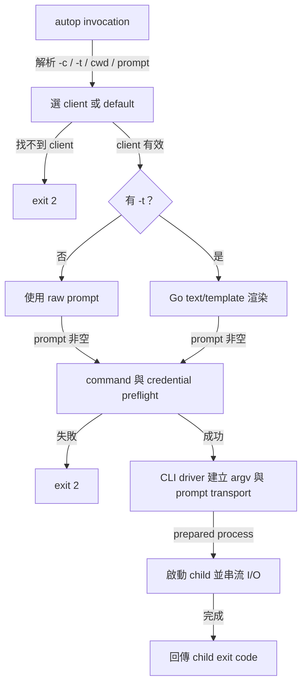

# `autop` LLM CLI Façade 架構計畫

日期：`2026-07-26`

狀態：`implemented and live wizard validated`

## 1. 目標與範圍 (Goal & Scope)

新增獨立 Go CLI `autop`，作為多個 LLM CLI tool 的單一執行入口。使用者與
`ecosystem.config.js` 只需要保存 façade 的 client、prompt template、permission
bypass、model 與 effort 選擇，不再重複維護各工具的 provider-specific flags 或
prompt 注入方式。

主要契約：

```bash
autop [-c <client>] [-t <template>] [prompt...]
```

- `-c, --client` 選擇設定檔內的 client；未指定時使用 `default_client`。
- `-t, --template` 選擇設定檔內的 prompt template；未指定時完全跳過 template。
- `prompt` 可由 positional arguments 或 piped stdin 提供。
- `autop wizard` 依序選擇 CLI、template、permission bypass、client model、
  effort、task prompt 與 optional cron schedule；workspace 含有 `cmd/autop/` 時寫入
  `cmd/autop/ecosystem.config.js`，否則寫入 workspace 根目錄的 `ecosystem.config.js`。
- 有 `-t` 時，Go 使用 `text/template` 展開 named template，再將結果注入 client。
- 無 `-t` 時，原始 prompt 不經 template，直接注入 client。
- Template 本身可以是完整 task，因此 `autop -c codex -t system` 不要求額外 prompt。
- 沒有 template 且沒有任何 prompt 時，回傳 usage error，不啟動 client。
- 子程序 stdout、stderr 與 exit code 原樣傳回，讓 PM2 能正確判斷成功或失敗。
- 子程序啟動前使用 `log/slog` 輸出 shell-safe command；credential environment
  永不進入 command log。

成功條件：

- PM2 task 不包含任何 provider-specific flags。
- 在三個既有 CLI driver 內新增或調整 client profile，只改 runtime config 與 PM2 的
  `-c` 值；新增第四種 CLI family 才需要 Go driver。
- 新增 prompt template 只改 runtime config 或其引用的 template file。
- `autop` 只啟動 `agy`、`claude` 或 `codex` 本機 CLI，不建立 provider HTTP client。
- Prompt 不經 shell parsing；內容中的空白、換行、quote 與 shell metacharacter 不會被執行。
- OAuth session 與 API key 保留在各 client 原有的 credential boundary，`autop` 不保存或輸出 secret。
- `autop` 收到終止訊號時會停止 child process，並把 child failure 傳回 PM2。

不在本次範圍：

- 不實作常駐 HTTP service、queue 或 scheduler；排程仍由 PM2 負責。
- 不 import OpenAI、Anthropic、Antigravity API SDK，也不直接呼叫其 HTTP API。
- 不統一各 provider 的 OAuth login 或 API key 儲存方式。
- 不把跨 client template 強行映射成各 provider 的 native `system` role。
- 不支援任意 shell command string 或 `sh -c`。
- 不在第一版支援 session resume、fallback chain、parallel fan-out 或 retry。

`-t system` 的 `system` 是 façade 內的 template ID。第一版一律把渲染結果當作
client 的初始 task prompt；這是 `codex`、`claude` 與 `agy` 都能維持一致的共同語意。

## 2. 現況架構 (Current Architecture)

目前 `ecosystem.config.js` 的 planner task 直接知道 `agy` command、`--add-dir` 與
`-p` prompt flag：


本機已確認的實際 command：

| `-c` 值 | 實際 CLI | 現況 |
| -------- | -------- | ---- |
| `agy` | `agy --print` | 可用 flags 選 model、effort、auto approval，prompt 使用 argument |
| `codex` | `codex exec` | 可用 flags 選 model、effort、auto approval，支援 stdin prompt |
| `claude` | `claude -p` | 官方／OAuth profile |
| `claudem` | `claude -p` | MiniMax profile；現有 `~/bin/claudem` 可繼續供人工直接使用 |
| `claudew` | `claude -p` | llmbox profile；現有 `~/bin/claudew` 可繼續供人工直接使用 |
| `claudep` | `claude -p` | AgentSDK proxy profile；目前只有 shell alias |
| `claudet` | `claude -p` | 尚無 executable、settings 或 credential contract，先 disabled |

Shell alias 不適合作為 PM2 dependency，因為非互動程序不保證載入 login shell alias。
因此 `claudem` 等名稱是 `autop` client profile ID；`autop` 直接啟動真正的 `claude`
executable，不 source shell alias。

本機 `agy` headless contract 已確認包含 `--print`、`--model`、`--effort`、
`--dangerously-skip-permissions` 與 `--add-dir`。Model selector 由 client profile
的 `models` queue 管理；effort 由高至低為 `high`、`medium`、`low`。

## 3. 架構位置與邊界 (Placement & Boundaries)

```tree
main.go                  # `autop` binary、signal 與 exit code
cmd/autop/
├── command.go          # Cobra flags、stdin/argument prompt input
├── settings.go         # config.Default、defaults、decode 與 validation
├── settings.example.json # 完整 client 與 template 設定參考
├── template.go         # text/template 渲染與 template file 載入
├── driver/             # 獨立 CLI process adapter package
│   ├── driver.go       # 公開 config、credential、process 與 Prepare contract
│   ├── agy.go          # agy flags 與 prompt injection
│   ├── claude.go       # Claude profiles、settings 與 credential env
│   ├── codex.go        # Codex flags 與 stdin prompt
│   └── driver_test.go  # driver package mapping tests
├── runner.go           # credential preflight 與 exec
├── wizard.go           # 互動式 PM2 task 與 optional cron 設定
├── install.go          # managed PM2 task 與 ecosystem.config.js 原子更新
├── ecosystem.config.js # autop PM2 managed tasks
└── *_test.go
```

`autop` 的 command implementation、driver、設定範本與 PM2 managed task 集中在
`cmd/autop/`；repo root 的 `main.go` 只保留 composition root。Repository root 的
`ecosystem.config.js` 只保留 Ollama 與 Agent
Memory 等非 `autop` 程序；使用 PM2 載入 `cmd/autop/ecosystem.config.js` 啟動
`autop` tasks。

`cmd/autop` 的 command、設定載入、template、runner 與 wizard 保持在 `autop`
package；repo root 的 `main.go` 是 composition root。純 CLI process mapping 下沉至
獨立 `cmd/autop/driver` package。Driver 不依賴 Cobra 或 Viper，可由其他 composition
root 重用。

```mermaid
flowchart LR
    PM2["PM2 cron task"] -->|"autop -c ... -t ..."| CLI["cmd/autop Cobra"]
    CLI -->|"讀取"| CFG["gosdk config + Viper"]
    CLI -->|"client、raw prompt"| Render["Go template renderer"]
    CFG -->|"client definition、template"| Render
    Render -->|"rendered prompt"| Driver["CLI argv driver"]
    Driver -->|"prepared process"| Runner["exec.CommandContext runner"]
    Runner -->|"stdin 或 argument"| Client["agy / claude / codex"]
    Client -->|"OAuth 或 inherited env"| Provider["LLM provider"]
```



邊界規則：

- PM2 只管理 schedule、cwd、log 與 process lifecycle。
- Runtime config 是 client registry、default client 與 template registry 的單一來源。
- `cmd/autop` 只啟動已註冊 client，不接受任意 executable override。
- `cmd/autop/driver` 只負責 CLI argv、stdin 與 child environment，不包含任何 API request。
- `claudem` 等 Claude profiles 保留 provider settings 與 credential environment wiring。
- `autop` 只驗證必要環境變數是否存在，不讀取、保存或記錄其值。

## 4. Runtime Configuration Contract

`autop` 是獨立 app name。`settings.go` 使用
`gosdk/config.Default(config.WithAppName("autop"))` 載入：

- Base：`~/.config/autop/settings.json`
- Machine-private override：`~/.config/autop/settings.local.json`

`default_client`、`clients` 與 `templates` 直接位於 app config root；`settings.go`
從全域 Viper decode 設定，local file 維持 deep-merge override。

此設計以前置約束成立為準：

- 執行 `autop` 的 workspace 不會有 `./settings.json` 或 `./conf/settings.json`。
- `autop` 使用獨立 app config directory，不與 `cc-plugin` 的設定欄位重名。

因此不另建 config loader，也不呼叫既有 `cc-plugin/config.Init()`。不要把 runtime
設定加入 repo 內供 Codex 自身使用的 `config/config.toml`。

建議設定：

```json
{
  "default_client": "codex",
  "clients": {
    "agy": {
      "driver": "agy",
      "command": "agy",
      "auto_approve": true,
      "model": "gemini-3.6-flash-high",
      "models": [
        "gemini-3.6-flash-high",
        "gemini-3.6-flash-medium",
        "gemini-3.6-flash-low",
        "gemini-3.5-flash-high",
        "gemini-3.5-flash-medium",
        "gemini-3.5-flash-low",
        "gemini-3.1-pro-high",
        "gemini-3.1-pro-low",
        "claude-sonnet-4-6",
        "claude-opus-4-6-thinking",
        "gpt-oss-120b-medium"
      ],
      "effort": "high",
      "prompt_transport": "argument",
      "credential": {
        "mode": "oauth"
      }
    },
    "codex": {
      "driver": "codex",
      "command": "codex",
      "auto_approve": true,
      "model": "gpt-5.6-sol",
      "models": ["gpt-5.6-sol", "gpt-5.6-luna", "gpt-5.5", "gpt-5.3-codex-spark"],
      "effort": "xhigh",
      "efforts": ["max", "xhigh", "high", "medium", "low"],
      "prompt_transport": "stdin",
      "credential": {
        "mode": "oauth"
      }
    },
    "claude": {
      "driver": "claude",
      "command": "claude",
      "auto_approve": true,
      "model": "opus",
      "effort": "max",
      "settings": "~/projects/cc-plugin/config/settings.json",
      "prompt_transport": "argument",
      "credential": {
        "mode": "oauth"
      }
    },
    "claudem": {
      "driver": "claude",
      "command": "claude",
      "auto_approve": true,
      "model": "MiniMax-M3",
      "effort": "xhigh",
      "settings": "~/projects/cc-plugin/config/minimax.json",
      "prompt_transport": "argument",
      "credential": {
        "mode": "env",
        "source_env": "MINIMAX_API_KEY",
        "target_env": "ANTHROPIC_AUTH_TOKEN"
      }
    },
    "claudew": {
      "driver": "claude",
      "command": "claude",
      "auto_approve": true,
      "model": "minimax-m3",
      "effort": "xhigh",
      "settings": "~/projects/cc-plugin/config/llmbox.json",
      "prompt_transport": "argument",
      "credential": {
        "mode": "env",
        "source_env": "TIKTOK_API_KEY",
        "target_env": "ANTHROPIC_AUTH_TOKEN"
      }
    },
    "claudep": {
      "driver": "claude",
      "command": "claude",
      "auto_approve": true,
      "model": "gemini-3.5-flash",
      "effort": "high",
      "settings": "~/projects/cc-plugin/config/proxy.json",
      "prompt_transport": "argument",
      "credential": {
        "mode": "env",
        "source_env": "AGENTSDK_PROXY_API_KEY",
        "target_env": "ANTHROPIC_AUTH_TOKEN"
      }
    },
    "claudet": {
      "disabled": true,
      "driver": "claude",
      "command": "claude",
      "auto_approve": true,
      "model": "",
      "effort": "",
      "settings": "",
      "prompt_transport": "argument",
      "credential": {
        "mode": "env",
        "source_env": "",
        "target_env": "ANTHROPIC_AUTH_TOKEN"
      }
    }
  },
  "templates": {
    "system": {
      "content": "run {{if eq .Driver \"codex\"}}$system-planner{{else}}/system-planner{{end}} for current workspace{{if .Prompt}}\n\n{{.Prompt}}{{end}}"
    },
    "auto-evolving": {
      "content": "run {{if eq .Driver \"codex\"}}$auto-evolving{{else}}/auto-evolving{{end}} for current workspace{{if .Prompt}}\n\n{{.Prompt}}{{end}}"
    },
    "codex-base": {
      "file": "~/projects/cc-plugin/pkg/system-prompts/CL4R1T4S/OPENAI/Codex.md"
    }
  }
}
```

設定模型：

```go
type Settings struct {
    DefaultClient string                    `mapstructure:"default_client"`
    Clients       map[string]ClientConfig   `mapstructure:"clients"`
    Templates     map[string]TemplateConfig `mapstructure:"templates"`
}

type ClientConfig struct {
    Disabled        bool             `mapstructure:"disabled"`
    Driver          string           `mapstructure:"driver"`
    Command         string           `mapstructure:"command"`
    AutoApprove     bool             `mapstructure:"auto_approve"`
    Model           string           `mapstructure:"model"`
    Models          []string         `mapstructure:"models"`
    Effort          string           `mapstructure:"effort"`
    Efforts         []string         `mapstructure:"efforts"`
    Settings        string           `mapstructure:"settings"`
    PromptTransport string           `mapstructure:"prompt_transport"`
    Credential      CredentialConfig `mapstructure:"credential"`
}

type CredentialConfig struct {
    Mode      string `mapstructure:"mode"`
    SourceEnv string `mapstructure:"source_env"`
    TargetEnv string `mapstructure:"target_env"`
}

type TemplateConfig struct {
    Content string `mapstructure:"content"`
    File    string `mapstructure:"file"`
}

type TemplateData struct {
	Prompt  string
	WorkDir string
	Client  string
	Driver  string
}
```

Validation：

- `default_client` 必須存在於 `clients`。
- Client ID 與 template ID 必須為穩定的 `kebab-case`。
- Disabled client 不得成為 `default_client`，也不能被 `-c` 選取。
- Enabled client 的 `driver` 只允許 `agy`、`claude`、`codex`。
- `command` 不得為空，且必須能由 `exec.LookPath` 或絕對路徑解析。
- Enabled client 的 `model` 與 `effort` 不得為空。
- `agy` model 必須存在於 client profile 的 `models` queue；effort 只允許
  `high`、`medium`、`low`。
- `claude` effort 只允許 `max`、`xhigh`、`high`、`medium`、`low`；model 由
  Claude CLI／gateway 最終驗證。
- `codex` model 與 effort 由 Codex CLI 最終驗證，`autop` 不複製 account-specific
  model registry。
- Wizard 對已知 effort 使用 `max`、`xhigh`、`high`、`medium`、`low` 的固定排序，
  並只顯示 client profile 所設定的項目。
- `prompt_transport` 必須符合 driver：`agy=argument`、`claude=argument`、
  `codex=stdin`。
- `claude` client 必須提供存在的 settings file；路徑支援 `~` 展開。
- Credential mode 只允許 `oauth` 或 `env`。`env` mode 必須同時提供
  `source_env` 與 `target_env`，且 source variable 必須存在。
- Template 的 `content` 與 `file` 必須恰好設定一個。
- `file` 支援 `~` 展開；讀取失敗即停止，不 fallback 成空 prompt。
- Go template 使用 `Option("missingkey=error")`。
- Template 只提供 `.Prompt`、`.WorkDir`、`.Client`、`.Driver`，不直接暴露 environment。

`claudet` 已保留 profile ID，但本機目前沒有對應 settings／credential contract；
完成這兩項設定前保持 disabled，不猜測 API key 名稱或 provider。

### 4.1 CLI argv 與 prompt 注入

| Driver | 明確 `--bypass-permission=true` | Model／effort | Prompt 注入 |
| ------ | ------------------- | ------------- | ----------- |
| `agy` | `--dangerously-skip-permissions` | `--model=<model> --effort=<effort>` | `--print ... <prompt-argv>` |
| `claude` | `--dangerously-skip-permissions` | `--model <model> --effort <effort>` | `-p <prompt-argv>` |
| `codex` | `--dangerously-bypass-approvals-and-sandbox` | `--model <model> -c model_reasoning_effort="<effort>"` | 最後加入 `-`，完整 prompt 寫入 stdin |

實際 argv：

```text
agy --print --dangerously-skip-permissions \
  --model=gemini-3.6-flash-high --effort=high --add-dir <cwd> <prompt>

claude --dangerously-skip-permissions \
  --settings <settings> --model <model> --effort <effort> \
  --add-dir <cwd> --output-format text -p <prompt>

codex exec --dangerously-bypass-approvals-and-sandbox \
  --model <model> -c model_reasoning_effort="<effort>" \
  -C <cwd> -
```

以上只是 Go 建立的 executable 與 argv。`autop` 不使用 shell，也不把這些選項轉成
provider HTTP request。Claude env credential 只加入 child process environment：

```text
ANTHROPIC_AUTH_TOKEN=<value from configured source_env>
```

Profile 的 `auto_approve=true` 只作為 wizard 的 bypass 預設選項；直接執行 `autop`
時，只有明確提供 `--bypass-permission=true` 才會啟用各 CLI 的 permission bypass
flag，安全範圍也由該 CLI 決定；對 Codex 而言同時會停用 sandbox。

## 5. CLI 與資料流 (Interfaces & Data Flow)

### 5.1 Prompt input precedence

1. Positional arguments 以單一空格連接成 raw prompt。
2. 若沒有 positional arguments，且 stdin 是 pipe，讀取 stdin。
3. 同時提供 positional arguments 與 piped stdin 時拒絕，避免不明確拼接。
4. 指定 `-t` 時，以 raw prompt 作為 `.Prompt` 渲染 template。
5. 未指定 `-t` 時，final prompt 等於 raw prompt。
6. Final prompt 為空時拒絕執行。

### 5.2 核心函式 contract

| 函式 | 輸入 | 輸出／責任 |
| ---- | ---- | ----------- |
| `LoadSettings()` | Global Viper state | Decode 並完整驗證 `autop` 設定 |
| `ResolvePrompt()` | template ID、raw prompt、cwd、client | 讀取並渲染 final prompt |
| `BuildCommand()` | driver、client config、final prompt、cwd | 建立 CLI executable、argv、stdin 與 child env |
| `Run()` | context、prepared command | 串流 I/O、等待 child、回傳 exit code |

`BuildCommand()` 只在 `agy`、`claude`、`codex` 三個 CLI driver 間分派。Driver 是
process adapter，不是 provider adapter：只產生 argv／stdin／environment，不得
import API SDK、建立 HTTP client 或解析 provider response。

### 5.3 執行流程



Exit code：

| Code | 語意 |
| ---: | ---- |
| `0` | Child 成功 |
| `2` | CLI usage、設定、template、command 或 credential preflight 錯誤 |
| 其他 | Child 原始 exit code |

## 6. PM2 Contract

`ecosystem.config.js` 不保存 `agy` 或其他 provider-specific flags。使用 wizard：

```bash
autop wizard
# 或使用短 alias
autop w
```

Wizard 依序詢問：

1. CLI
2. Template（可選 `(none)`）
3. 是否 bypass permission
4. 所選 CLI 的 model
5. 所選 CLI 的 effort
6. Task prompt：有 template 時可留白；選擇 `(none)` 時必填
7. Cron schedule：預設 `N` 不排程；`r` 在 `02:00–08:00` 之間隨機選定每日時間；
   自訂排程必須完整輸入五欄 cron

完成後會建立或冪等更新以下 managed block：

```javascript
{
    name: "AutoP codex system",
    script: "autop",
    args: [
        "-c",
        "codex",
        "-t",
        "system",
        "--bypass-permission=true",
        "--model",
        "gpt-5.6-sol",
        "--effort",
        "xhigh",
        "--",
        "review current workspace"
    ],
    cwd: "/absolute/workspace/path",
    namespace: "autop",
    instances: 1,
    optional: true,
    cron: "0 3 * * *",
    autorestart: false,
    watch: false
}
```

Wizard 的 CLI 預設選項來自 `default_client`；選擇 `(none)` template 時不寫入
template flag：

```javascript
args: [
    "-c",
    "agy",
    "--bypass-permission=false",
    "--model",
    "gemini-3.6-flash-high",
    "--effort",
    "high",
    "--",
    "review current workspace"
]
```

Cron schedule 是 optional；預設 `N` 時不寫入 `cron`。輸入 `r` 時，wizard 會在
`02:00–08:00`（含端點）之間隨機選定一個時間並保存為每日固定 cron；其他輸入必須
是完整五欄 cron。Autop 是一次性 task，因此使用 PM2 `cron` 搭配
`autorestart: false`，不使用 `cron_restart`；managed task 固定設為
`optional: true`。Wizard 保留既有 apps，以
`// autop:begin <task>`／`// autop:end <task>` 管理相同 task，並以 temporary file
加 atomic rename 寫入。`cwd` 取自執行 wizard 時的 workspace 絕對路徑，不依賴
PM2 載入 JavaScript 時的 `__dirname`。PM2 顯示名稱固定使用
`AutoP <client> <template>`；未指定 template 時省略最後一段。

PM2 啟動時的 environment 必須已包含 API-key client 所列的 credential
`source_env`。OAuth client 則使用該 executable 原有的 login state。不得把 API key
literal 寫入 `ecosystem.config.js`、runtime JSON、command args 或 log。

## 7. 清晰與可擴充性檢查 (Clarity & Scalability Check)

| 檢查 | 結果 |
| ---- | ---- |
| 單一責任 | PM2 排程、Go façade 選擇／渲染、client credential 各自獨立 |
| 依賴方向 | `ecosystem -> autop -> registered client`，client 不依賴 PM2 |
| 可替換性 | Client ID 映射至 command；切換 provider 不改 task |
| 擴充點 | 三個 CLI family 內的新 profile 與 template 皆為資料驅動 |
| 安全性 | 不用 shell；記錄 command 但不記錄 environment／secret；API key 只注入 child env |
| 可測試性 | Settings、template、argv 與 exit-code propagation 可分開測試 |
| 水平擴充 | PM2 可建立多個不同 `-c`／`-t` task，互不共享 runtime state |

刻意不提供「每次 CLI 動態覆寫 provider flags」的選項。這些 flags 必須在 client
definition 中有單一來源，才能達成不必逐一重配的原始目標。

## 8. 漸進落地步驟 (Incremental Steps)

### Step 1 — 建立 standalone `autop` binary 與設定驗證

- 新增 `cmd/autop`，解析 `-c`、`-t` 與 positional/stdin prompt。
- 在 `cmd/autop/settings.go` 以 app name `autop` 初始化設定並宣告非敏感 defaults。
- 實作 global Viper config decode 與 validation。
- 測試 default client、unknown client、input precedence、deep merge 與 invalid config。
- 回滾：移除 `cmd/autop` 與新增 defaults，不影響現有 `cc-plugin`。

### Step 2 — 實作 Go template renderer

- 支援 inline `content` 與 registered `file`。
- 使用限定的 `TemplateData` 與 `missingkey=error`。
- 測試有／無 `-t`、template-only task、unknown template、file error 與 multiline prompt。
- 回滾：保留 raw-prompt runner，停用 `-t`。

### Step 3 — 實作安全 child runner

- 使用 `exec.CommandContext`，不使用 `sh -c`。
- 使用 `log/slog` 在 child 啟動前列出 shell-safe command。
- 實作 `agy`、`claude`、`codex` 三個 argv driver。
- 映射 `auto_approve`、`model`、`effort` 與 `stdin`／`argument` prompt transport。
- 驗證 executable、settings file 與 credential `source_env`。
- 串流 stdout/stderr、轉送 cancellation、保留 child exit code。
- 測試每個 driver 的完整 argv、shell metacharacter 不被執行、missing env 與 child
  failure。
- 回滾：尚未變更 PM2，現有 task 不受影響。

### Step 4 — 註冊本機 clients 並做非破壞 smoke test

- 在 machine-local config 設定 `agy`、`codex`、`claude`、`claudem`、`claudew`、
  `claudep` 與 disabled `claudet`。
- 先用 fake executable 驗證完整 argv 與 prompt，再用最小 real prompt 驗證各 client。
- OAuth/API key 只驗證可用性，不輸出 credential。
- 為 `claudet` 補齊 settings、model 與 credential contract 後才允許 enable。
- 回滾：移除 machine-local `autop` 設定即可。

### Step 5 — 遷移 PM2 task

- 把既有 `agy-cc-plugin-system` task 改為 `autop -c agy -t system`，先保留相同 cron。
- 驗證 PM2 log、exit code、cwd 與 non-interactive credential environment。
- 驗證成功後，其他 task 才逐一改用 `autop`。
- 回滾：PM2 task 恢復原本 `agy --add-dir ... -p ...`。

### Step 6 — 同步專案文件

- 在 `README.md` 加入 `autop` 業務流程與使用範例。
- 在 `CLAUDE.md` 加入 `cmd/autop`、configuration contract 與關鍵決策。
- 在 `docs/terminology.md` 定義 `autop`、`client ID`、`prompt template`。
- 實作完成並接受後，把本計畫移至 `docs/specs/`。

## 9. 驗收案例 (Acceptance Cases)

```bash
# 使用 default client，不套 template
printf '%s' 'summarize current repository' | autop

# 選擇 client，不套 template
autop -c claudem 'summarize current repository'

# 使用 agy 的已配置 model／effort／auto approval
autop -c agy -t system

# 使用完整 template，不提供額外 prompt
autop -c codex -t system

# Template 包裝額外 prompt
autop -c claudew -t system 'focus on dependency boundaries'

# 使用 AgentSDK proxy Claude profile
autop -c claudep 'review the current change'

# PM2 使用 default client
autop -t system

# 互動設定並安裝或更新 PM2 task
autop wizard
```

必須通過：

- 移除 `-c` 後實際使用設定的 default client。
- 移除 `-t` 後完全不讀取或套用任何 template。
- `agy` 收到 `--print`、auto approval、model、effort、cwd 與單一完整 prompt argument。
- `claude` family 收到 `-p`、auto approval、model、effort、settings 與單一完整 prompt
  argument。
- `codex` 收到 auto approval、model、reasoning effort 與 cwd flags，並從 stdin 收到
  byte-identical final prompt。
- 缺少 `MINIMAX_API_KEY`、`TIKTOK_API_KEY` 或 `AGENTSDK_PROXY_API_KEY` 時，在啟動
  child 前失敗，log 不含 value。
- `-c claudet` 在 profile disabled 時明確拒絕執行。
- Child 回傳非零時，`autop` 與 PM2 看見相同 exit code。
- Child 啟動前可在 `slog` 看到 executable 與完整 arguments，但不含 credential
  environment。
- Wizard 固定依 CLI、template、permission bypass、model、effort、task prompt、optional
  cron schedule 排序；template 存在時 task prompt 可留白，選擇 `(none)` 時 task prompt
  必填；cron 預設為 `N`，`r` 產生 `02:00–08:00` 之間的每日排程，自訂值
  必須包含五欄。
- Model 與 effort 選項依所選 client profile 提供。
- 重複執行相同 client／template 的 `autop wizard` 不會建立重複 PM2 task。
- Prompt 內的 `$(...)`、backtick、quote、semicolon 與 newline 皆只作為文字。
- Go dependency 與 runtime trace 均不得出現 provider API SDK／direct HTTP request。
